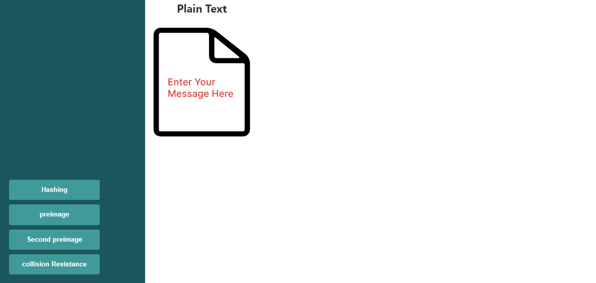
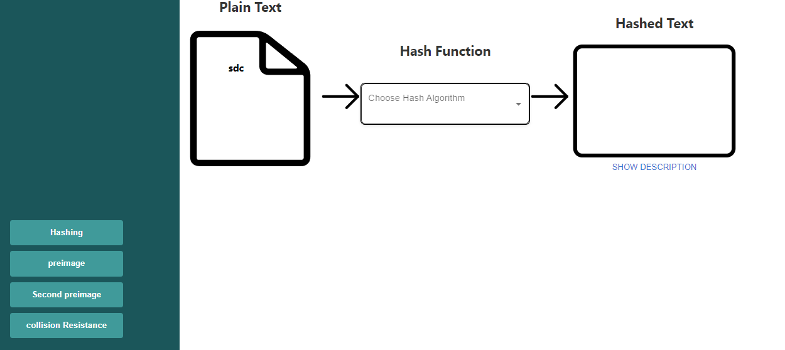
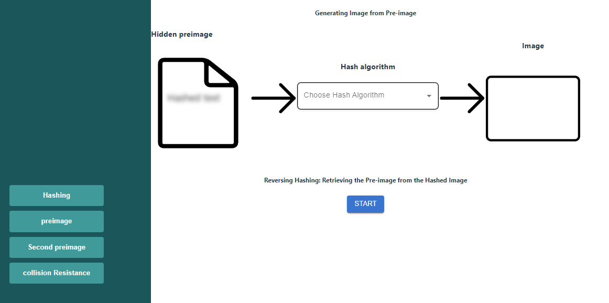
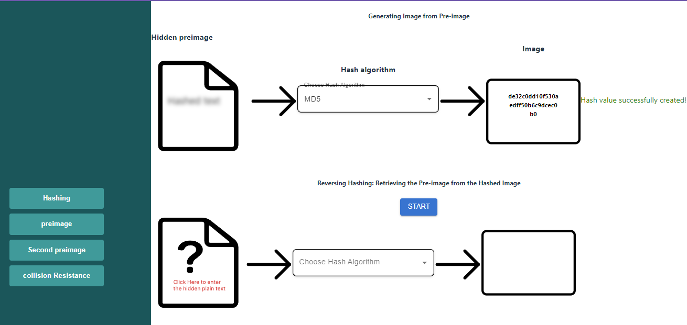
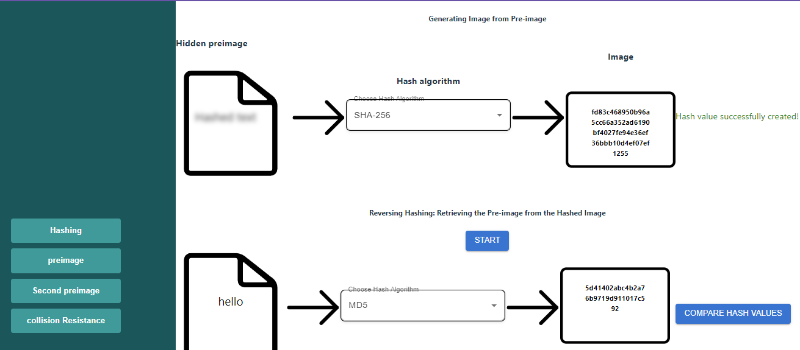
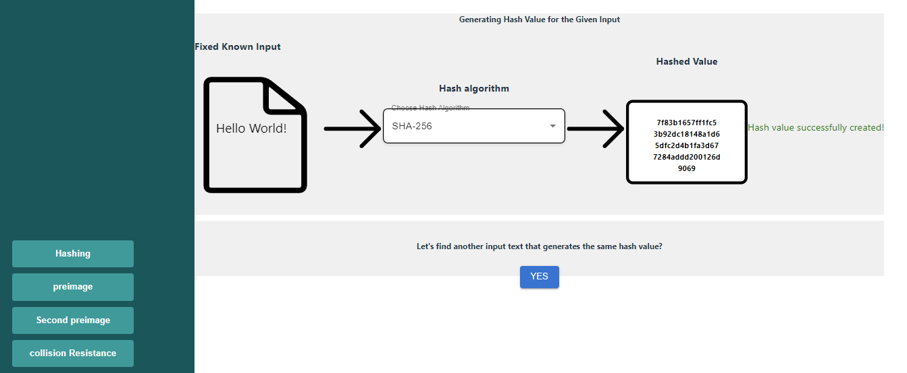
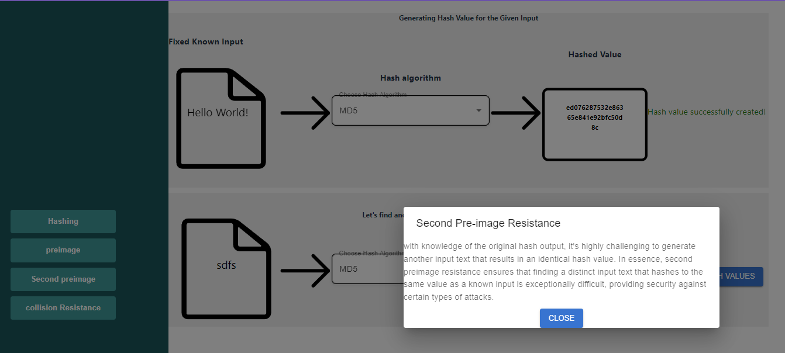

### Procedure
<h5>Hashing</h5>

 click on the hashing button and enter the message  you want to get hashed 

Select the algorithm with which you need to hash the message, such as MD5 or SHA-256. 

Hashed input value is displayed 

 click on the show description button to know the explanation of the algorithm

<h5>Preimage</h5>

 click on the Preimage button ,Select the algorithm with which you need to hash the message 

click on the start button to start the reversing process 

predict the message and try to retrive the message 

selet the algoirthm 

click on the compare hash values  button to check if both the hash values are same or not 

<h5>SecondPreimage</h5>

 click on the "Second Preimage" button.

 select the algorithm (MD5 or SHA-256).

The hashed value is displayed.

click on the "Yes" button to start predicting another input that will provide the same hash value as the one displayed.

 select the algorithm again.

The new hashed value is displayed.

clicks on the "Compare Hash Value" button.,The explanation is shown.

<h5>Collision Resistance</h5>

clicks on the "Collision Resistance" button.

enter the unknown input 1 text  

select the algorithm (MD5 or SHA-256).

The first hashed value is displayed.,

 selects the algorithm again,second hashed value is displayed.

