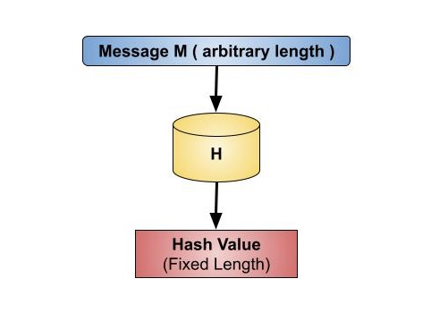
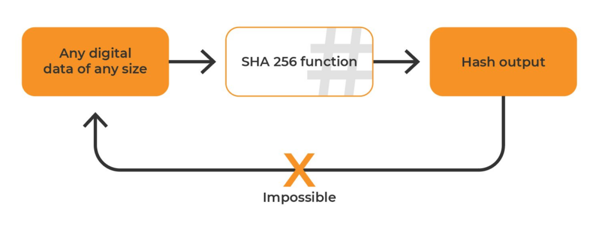
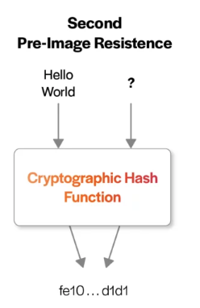
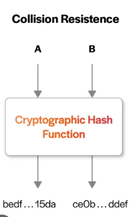

## Theory

Hash functions play a crucial role in various security applications, including password storage (hash values instead of passwords), digital signatures, and data integrity checks. Hash values, or message digests, are values that a hash function returns. The hash function is shown in the image below −

<h4>Properties of hash functions</h4>

Pre-Image Resistance

<li> Reversing a hash function should be computationally difficult.</li>
 <li>if a hash function h generates a hash value z, it should be difficult to identify an input value x that hashes to z.</li>

<h4>Second Pre-Image Resistance</h4>
<li>Given a known input and its hash, it should be difficult to find another input with the same hash.</li>
<li>it should be challenging to find another input value y such that h(y) equals h(x) if a hash function h for an input x returns the hash value h(x).</li>
<li>This feature of the hash function protects against an attacker who wants to replace a new value for the original input value and hash, but only holds the input value and its hash.</li>

<h4>Collision Resistance</h4>
<li>It is  difficult to identify two different inputs of any length that produce the same hash. This characteristic is also known as a collision-free hash function.</li>
<li>A hash function h, it is difficult to identify two distinct inputs x and y such that h(x)=h(y).</li>
<li>A hash function cannot be free of collisions because it is a compression function with a set hash length. The collision-free condition simply indicates that these collisions should be difficult to locate</li>

